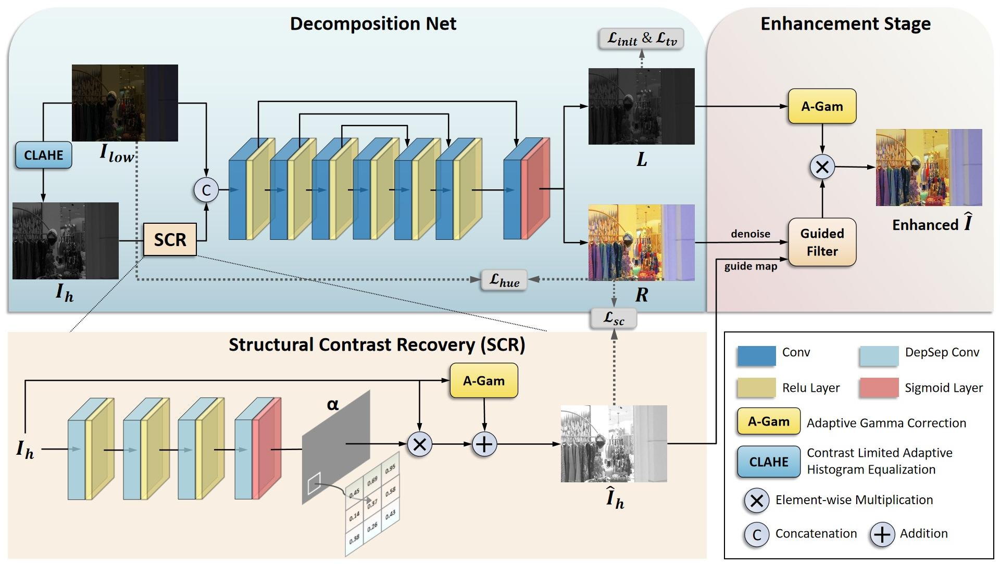

<div align="center">

# Degraded Structure and Hue Guided Auxiliary Learning for Low-Light Image Enhancement
</div>

The official pytorch implementation of SHAL-Net: Degraded Structure and Hue Guided Auxiliary Learning for Low-Light Image Enhancement.

Authors: Heming Xu, Xintong Liu, Hanwen Zhang, Xiaohe Wu* 

## Overview


[[**Paper**]]()
[[**Code**]](https://github.com/hmx-harry/SHAL-Net)

## Requirements
- python 3.8
- pytorch >= 1.12.0
- CPU or NVIDIA GPU

## 🔧 Setup
Type this command:
```
pip install -r requirements.txt
```

## 📎 Datasets
- Datasets are random selected from publicly available datasets. [LOL](https://daooshee.github.io/BMVC2018website/), [SICE](https://github.com/csjcai/SICE) and [LSRW](https://github.com/JianghaiSCU/R2RNet#dataset)
- You can download our training and testing sets at [Google Drive](https://drive.google.com/file/d/1Uvud3dWFbcy-91mFOD7tQ1ZXtotFtnqB/view?usp=sharing).
## ⚡️ Testing
- Pre-trained wright is in ```./weights```.
- Enhancing image: check paths of testing images and output folder in detect.py, and then run:
```
python detect.py
```
- Evaluating metrics: check paths of testing images and reference folder in detect.py, and then run:
```
python eval_metrics.py
```


## 🤖 Training
- Preparing training set, just need low-light images
- Check training set and output weight paths in train.py, and then run:
```
python train.py
```


## 📌 Citation
If you think our work is useful for your research, please cite our paper by the following:
```bibtex
@article{xu2024degraded,
  title={Degraded Structure and Hue Guided Auxiliary Learning for low-light image enhancement},
  author={Xu, Heming and Liu, Xintong and Zhang, Hanwen and Wu, Xiaohe and Zuo, Wangmeng},
  journal={Knowledge-Based Systems},
  pages={111779},
  year={2024},
  publisher={Elsevier}
}
```

